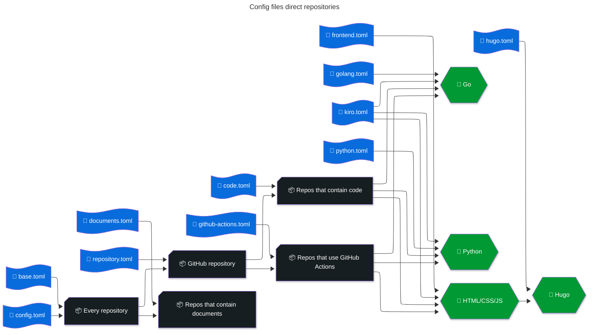

# Config Manager

```mermaid
---
title: Config files direct repositories
displayMode: compact
config:
  look: neo
  layout: elk
  elk:
    mergeEdges: false
    nodePlacementStrategy: BRANDES_KOEPF
    nodePlacementAlignment: BALANCED
---
flowchart LR
  base@{ shape: paper-tape, label: "📄 base.toml" }
  code@{ shape: paper-tape, label: "📄 code.toml" }
  config@{ shape: paper-tape, label: "📄 config.toml" }
  documents@{ shape: paper-tape, label: "📄 documents.toml" }
  frontend@{ shape: paper-tape, label: "📄 frontend.toml" }
  githubActions@{ shape: paper-tape, label: "📄 github-actions.toml" }
  golang@{ shape: paper-tape, label: "📄 golang.toml" }
  hugo@{ shape: paper-tape, label: "📄 hugo.toml" }
  kiro@{ shape: paper-tape, label: "📄 kiro.toml" }
  python@{ shape: paper-tape, label: "📄 python.toml" }
  repository@{ shape: paper-tape, label: "📄 repository.toml" }

  everyRepo@{ shape: notch-rect, label: "📦 Every repository" }
  everyGitHubRepo@{ shape: notch-rect, label: "📦 GitHub repository" }
  docRepo@{ shape: notch-rect, label: "📦 Repos that contain documents" }
  codeRepo@{ shape: notch-rect, label: "📦 Repos that contain code" }
  ghaRepo@{ shape: notch-rect, label: "📦 Repos that use GitHub Actions" }

  goRepo@{ shape: "hex", label: "💬 Go" }
  pyRepo@{ shape: "hex", label: "💬 Python" }
  htmlRepo@{ shape: "hex", label: "💬 HTML/CSS/JS" }
  hugoRepo@{ shape: "hex", label: "💬 Hugo" }

  everyRepo --> everyGitHubRepo
  everyRepo --> docRepo
  everyGitHubRepo --> codeRepo

  base & config --> everyRepo

  code --> codeRepo
  documents --> docRepo
  repository --> everyGitHubRepo

  everyGitHubRepo & githubActions --> ghaRepo

  codeRepo & kiro & ghaRepo & golang --> goRepo
  codeRepo & kiro & ghaRepo & python --> pyRepo
  codeRepo & kiro & ghaRepo & frontend --> htmlRepo

  htmlRepo & hugo --> hugoRepo

  classDef file fill:#096cdc,color:#fff
  classDef repo fill:#171e21,color:#fff
  classDef lang fill:#093,color:#fff

  class base file
  class code file
  class config file
  class documents file
  class frontend file
  class githubActions file
  class golang file
  class hugo file
  class kiro file
  class python file
  class repository file

  class everyRepo repo
  class everyGitHubRepo repo
  class docRepo repo
  class codeRepo repo
  class ghaRepo repo

  class goRepo lang
  class pyRepo lang
  class htmlRepo lang
  class hugoRepo lang
```
